# lab5

## 练习一：

### do_execv函数调用load_icode（位于kern/process/proc.c中）来加载并解析一个处于内存中的ELF执行文件格式的应用程序。你需要补充load_icode的第6步，建立相应的用户内存空间来放置应用程序的代码段、数据段等，且要设置好proc_struct结构中的成员变量trapframe中的内容，确保在执行此进程后，能够从应用程序设定的起始执行地址开始执行。需设置正确的trapframe内容。

### 请在实验报告中简要说明你的设计实现过程

答：
    
    将tf->gpr.sp设置为用户栈顶部；
    将tf->epc设置为用户应用程序入口点，从此处开始执行；
    设置SPP为0，返回用户模式；
    设置SPIE为1，可以处理中断；

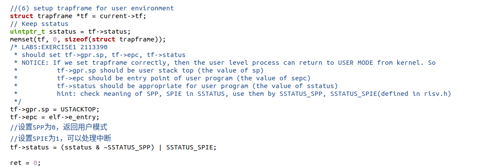

### 请简要描述这个用户态进程被ucore选择占用CPU执行（RUNNING态）到具体执行应用程序第一条指令的整个经过。

答：过程如下：

·用户态进程调用exec系统调用，转入到系统调用的处理例程；

·在经过了正常的中断处理例程后，将kernel_execve把ld在链接hello应用程序执行码时定义的两个全局变量：

_binary_obj___user_hello_out_start：hello执行码的起始位置

_binary_obj___user_hello_out_size中：hello执行码的大小

作为SYS_exec系统调用的参数，让ucore来创建此用户进程。当ucore收到此系统调用后，将依次调用如下函数：

vector128(vectors.S)-->__alltraps(trapentry.S)-->trap(trap.c)-->trap_dispatch(trap.c)---->syscall(syscall.c)-->sys_exec(syscall.c)-->do_execve(proc.c)

当控制权转移到了syscall.c中的 syscall 函数时，其会根据系统调用号转移给 sys_exec 函数，在该函数中调用 do_execve 函数来完成指定应用程序的加载；

·在do_execve中，首先为加载新的执行码做好用户态内存空间清空准备，推出当前页表，设置页表为内核空间页表；然后调用 load_icode 函数，完成了对整个用户线程内存空间的初始化，包括堆栈的设置以及将 ELF 可执行文件的加载，之后通过 current->tf 指针修改了当前系统调用的 trapframe，使得最终中断返回的时候能够切换到用户态，并且同时可以正确地将控制权转移到应用程序的入口处(epc)；

·在完成了 do_exec 函数之后，进行正常的中断返回的流程，由于异常程序计数器 epc 已经被修改成了应用程序的入口处，而 status 是用户态，因此 iret 进行中断返回的时候会将堆栈切换到用户的栈，并且完成特权级的切换，并且跳转到要求的应用程序的入口处；

·接下来开始具体执行应用程序的第一条指令；

## 练习2: 父进程复制自己的内存空间给子进程（需要编码）

### 创建子进程的函数do_fork在执行中将拷贝当前进程（即父进程）的用户内存地址空间中的合法内容到新进程中（子进程），完成内存资源的复制。具体是通过copy_range函数（位于kern/mm/pmm.c中）实现的，请补充copy_range的实现，确保能够正确执行。

### 请在实验报告中简要说明你的设计实现过程。

答：copy_range复制page的内容到npage，并建立npage的物理地址和虚拟地址的映射关系

宏和函数：

    page2kva(struct Page *page): 返回页面管理的内存的内核虚拟地址（见pmm.h）
    page_insert: 建立页面的物理地址和线性虚拟地址的映射
    memcpy: 典型的内存复制函数
    
实现思路：

    (1) 找到src_kvaddr: page的内核虚拟地址
    (2) 找到dst_kvaddr: npage的内核虚拟地址
    (3) 从src_kvaddr复制到dst_kvaddr，大小为PGSIZE
    (4) 建立npage的物理地址和虚拟地址的映射关系
    
如下具体代码与实现思路每一步对应：

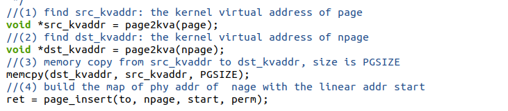

### 如何设计实现Copy on Write机制？给出概要设计，鼓励给出详细设计。

### Copy-on-write（简称COW）的基本概念是指如果有多个使用者对一个资源A（比如内存块）进行读操作，则每个使用者只需获得一个指向同一个资源A的指针，就可以该资源了。若某使用者需要对这个资源A进行写操作，系统会对该资源进行拷贝操作，从而使得该“写操作”使用者获得一个该资源A的“私有”拷贝—资源B，可对资源B进行写操作。该“写操作”使用者对资源B的改变对于其他的使用者而言是不可见的，因为其他使用者看到的还是资源A。

答：Copy on Write允许多个进程共享同一块内存区域，直到其中一个进程试图修改其中的内容时，才会进行实际的复制操作

**·理论设计：**

1. 进程创建时，内核为其分配一个页表，并将相应的物理页面映射到进程的虚拟地址空间；
2. 当多个进程共享同一块内存区域时，它们将共享同一个物理页面，即它们的页表项指向相同的物理地址；此时页面的访问权限设置为只读；
3. 当某个进程试图修改共享的内存区域时，处理器会触发一个页面错误异常；
4. 在页面错误异常处理程序中，内核会检查是否存在其他进程共享相同的物理页面；
5. 若该物理页面只被当前进程引用，内核将允许当前进程修改该页面，程序获得写入权限；
6. 如果该物理页面被多个进程共享，则内核会为当前进程分配一个新的物理页面，并将原始页面的内容复制到新页面上，这个过程称为“写时复制”；
7. 内核更新当前进程的页表项，使其指向新的物理页面；同时，内核将新页面标记为可写；
8. 当其他进程试图访问原始页面时，它们的页表项仍然指向原始页面；
9. 内核还需要跟踪每个页面的引用计数，以便在最后一个引用释放时，释放相应的物理页面；当一个新页面被创建时，它的引用计数初始化为1。当多个进程共享同一页面时，它们的引用计数都会增加；当某个进程结束时，内核会减少其映射的所有页面的引用计数；如果引用计数变为零，则内核释放相应的物理页面；

**·代码修改**

do fork 部分：在 copy_range 函数内部不再进行实质上的内存的复制，而是将子进程和父进程的虚拟页映射上同一个物理页面，然后在分别在这两个进程的虚拟页对应的PTE部分将这个页设置为只读，同时利用PTE中的保留位将这个页设置成共享的页面，此时如果某个应用程序试图写某一个共享页就会产生页访问异常，从而可以将控制权交给操作系统进行处理；

page fault 部分：在 page fault 的ISR部分，新增加对当前的异常是否由于尝试写了某一个共享页面引起的；若该物理页面只被当前进程引用，内核将允许当前进程修改该页面，程序获得写入权限；若该物理页面被多个进程共享，则内核会为当前进程分配一个新的物理页面，并将原始页面的内容复制到新页面上，内核更新当前进程的PTE，使其指向新的物理页面；同时，内核将新页面标记为可写且非共享；

## 练习3: 阅读分析源代码，理解进程执行 fork/exec/wait/exit 的实现，以及系统调用的实现（不需要编码）

### 请在实验报告中简要说明你对 fork/exec/wait/exit函数的分析。并回答如下问题：

### 请分析fork/exec/wait/exit的执行流程。重点关注哪些操作是在用户态完成，哪些是在内核态完成？内核态与用户态程序是如何交错执行的？内核态执行结果是如何返回给用户程序的？

答：如下逐一分析：

**·fork函数**

··调用过程为：

**
fork->SYS_fork->do_fork+wakeup_proc
**

首先当程序执行fork时，fork使用系统调用 SYS_fork，而系统调用 SYS_fork 则主要是由do_fork和wakeup_proc 来完成的；

其中do_fork()主要是完成了以下工作：

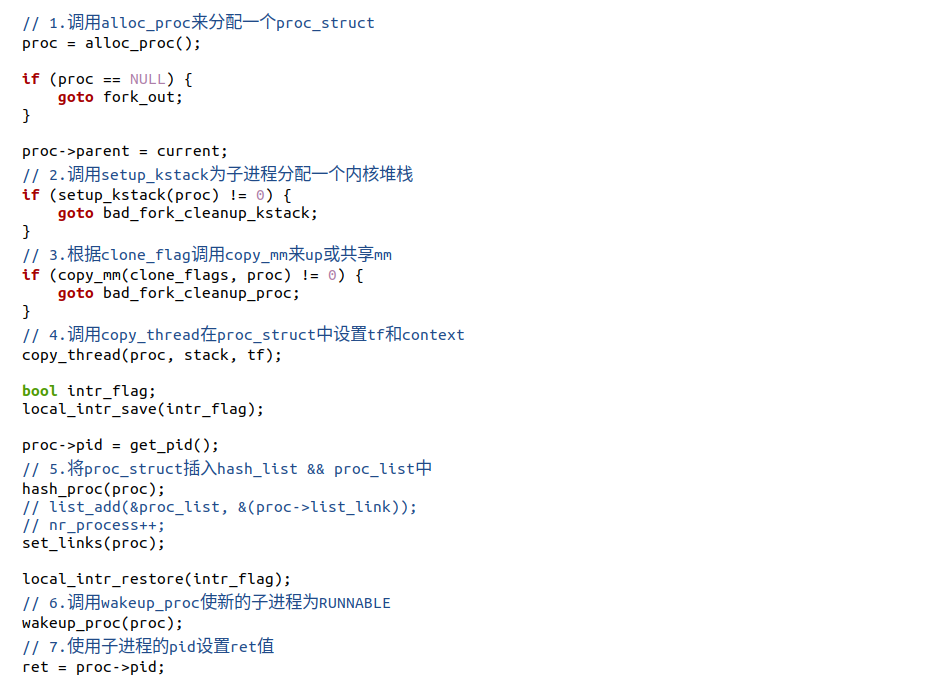

而 wakeup_proc 函数主要是将进程的状态设置为等待，即proc->wait_state = 0。

**·exec函数**

··exec调用过程为：

**
SYS_exec->do_execve
**

当应用程序执行时，会调用SYS_exec系统调用，而当 ucore 收到此系统调用的时候，则会使用do_execve() 函数来实现，

其中do_execve()函数完成用户进程的创建工作，同时使用户进程进入执行

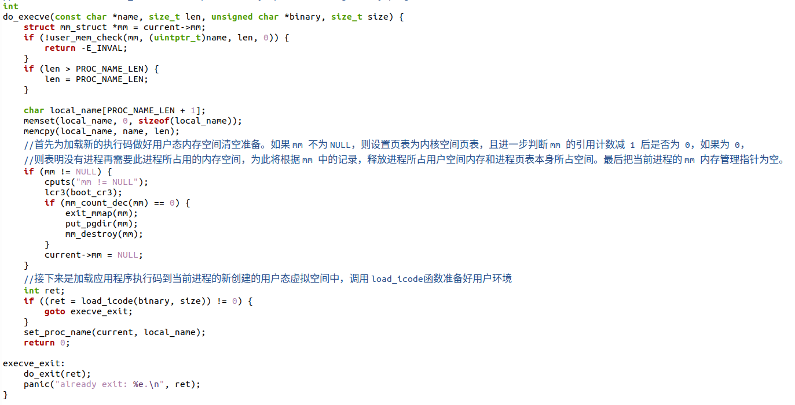

·wait函数

··调用过程为：

**
SYS_wait->do_wait
**

当执行wait功能时，会调用系统调用SYS_wait，而该系统调用的功能则由do_wait函数实现

do_wait函数完成父进程对子进程的最后回收工作

··检查是否为可访问的用户空间

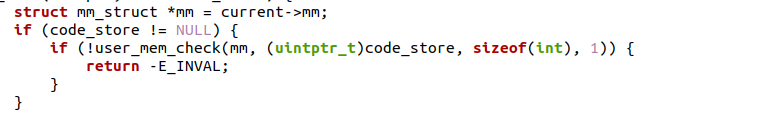

··如果 pid!=0，表示只找一个进程id号为pid的退出状态的子进程，否则找任意一个处于退出状态的子进程;

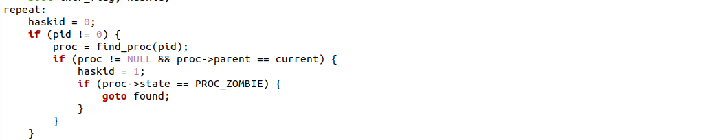

··如果此子进程的执行状态不为 PROC_ZOMBIE，表明此子进程还没有退出，则当前进程设置执行状态为PROC_SLEEPING，睡眠原因为WT_CHILD (即等待子进程退出)，调用 schedule()函数选择新的进程执行，重新回到repeat处执行;

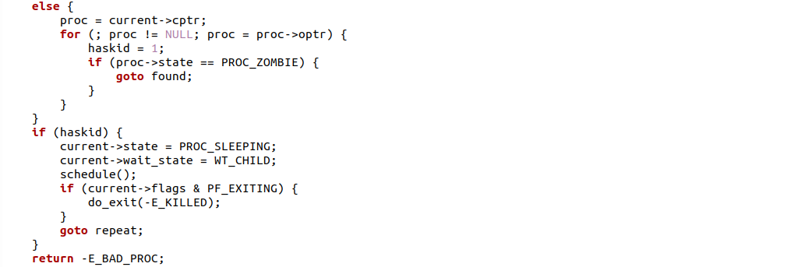

··如果此子进程的执行状态为 PROC_ZOMBIE，表明此子进程处于退出状态，需要当前进程(即子进程的父进程)完成对子进程的最终回收工作：

首先把子进程控制块从两个进程队列 proc_list 和 hash_list 中删除；

接着释放子进程的内核堆栈和进程控制块；

至此子进程彻底结束执行过程，释放其占用的所有资源

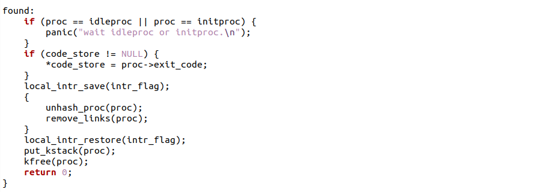

**·exit函数**

··调用过程为：

**
SYS_exit->exit
**

当执行exit功能时，会调用系统调用SYS_exit，而该系统调用功能则由do_exit函数实现

do_exit()回收当前进程所占的大部分内存资源，并通知父进程完成最后的回收工作：

··先判断是否是用户进程，如果是，则开始回收此用户进程所占用的用户态虚拟内存空间;

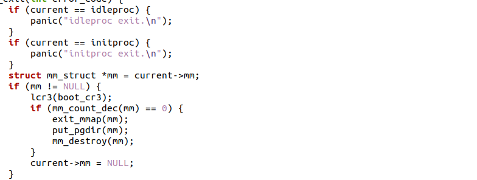

··设置当前进程状态为 PROC_ZOMBIE，设置当前进程的退出码为 error_code。表明此时这个进程已经无法再被调度了，只能等待父进程来完成最后的回收工作，回收该子进程的内核栈、进程控制块

··如果当前父进程已经处于等待子进程的状态，即父进程的 wait_state 被置为 WT_CHILD，则此时就可以唤醒父进程，让父进程来帮子进程完成最后的资源回收工作

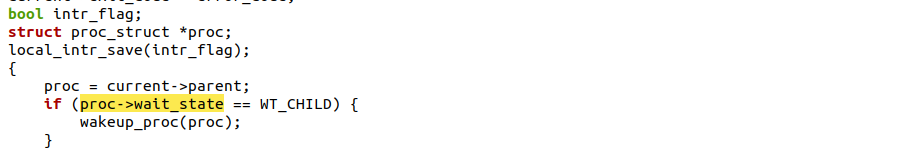

··如果当前进程还有子进程,则需要把这些子进程的父进程指针设置为内核线程 init，且各个子进程指针需要插入到 init 的子进程链表中；如果某个子进程的执行状态是 PROC_ZOMBIE，则需要唤醒 init 来完成对此子进程的最后回收工作

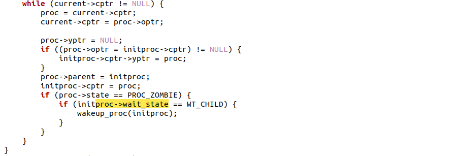

··执行 schedule() 调度函数，选择新的进程执行。

### 请给出ucore中一个用户态进程的执行状态生命周期图（包执行状态，执行状态之间的变换关系，以及产生变换的事件或函数调用）。（字符方式画即可）

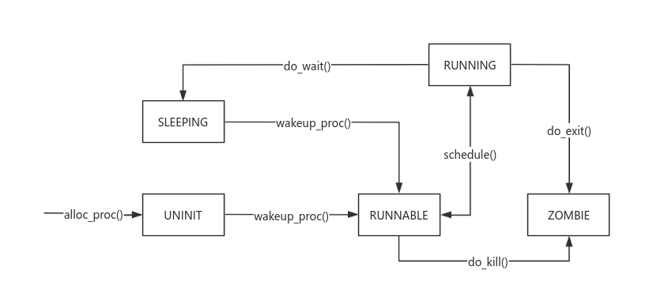

### 执行：make grade。如果所显示的应用程序检测都输出ok，则基本正确。（使用的是qemu-1.0.1）

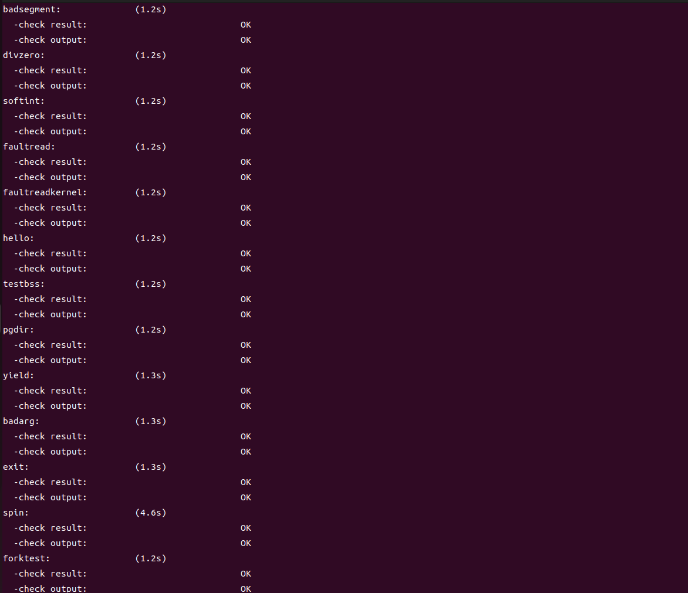

分数：

## Challenge 1

### 实现 Copy on Write （COW）机制

### 给出实现源码,测试用例和设计报告（包括在cow情况下的各种状态转换（类似有限状态自动机）的说明）。

### 这个扩展练习涉及到本实验和上一个实验“虚拟内存管理”。在ucore操作系统中，当一个用户父进程创建自己的子进程时，父进程会把其申请的用户空间设置为只读，子进程可共享父进程占用的用户内存空间中的页面（这就是一个共享的资源）。当其中任何一个进程修改此用户内存空间中的某页面时，ucore会通过page fault异常获知该操作，并完成拷贝内存页面，使得两个进程都有各自的内存页面。这样一个进程所做的修改不会被另外一个进程可见了。请在ucore中实现这样的COW机制。

### 由于COW实现比较复杂，容易引入bug，请参考 https://dirtycow.ninja/  看看能否在ucore的COW实现中模拟这个错误和解决方案。需要有解释。

### 这是一个big challenge.

**答：**

**·理论设计：**

1. 进程创建时，内核为其分配一个页表，并将相应的物理页面映射到进程的虚拟地址空间；
2. 当多个进程共享同一块内存区域时，它们将共享同一个物理页面，即它们的页表项指向相同的物理地址；此时页面的访问权限设置为只读；
3. 当某个进程试图修改共享的内存区域时，处理器会触发一个页面错误异常；
4. 在页面错误异常处理程序中，内核会检查是否存在其他进程共享相同的物理页面；
5. 若该物理页面只被当前进程引用，内核将允许当前进程修改该页面，程序获得写入权限；
6. 如果该物理页面被多个进程共享，则内核会为当前进程分配一个新的物理页面，并将原始页面的内容复制到新页面上，这个过程称为“写时复制”；
7. 内核更新当前进程的页表项，使其指向新的物理页面；同时，内核将新页面标记为可写；
8. 当其他进程试图访问原始页面时，它们的页表项仍然指向原始页面；
9. 内核还需要跟踪每个页面的引用计数，以便在最后一个引用释放时，释放相应的物理页面；当一个新页面被创建时，它的引用计数初始化为1。当多个进程共享同一页面时，它们的引用计数都会增加；当某个进程结束时，内核会减少其映射的所有页面的引用计数；如果引用计数变为零，则内核释放相应的物理页面；

**·代码修改**

do fork 部分：在 copy_range 函数内部不再进行实质上的内存的复制，而是将子进程和父进程的虚拟页映射上同一个物理页面，然后在分别在这两个进程的虚拟页对应的PTE部分将这个页设置为只读，同时利用PTE中的保留位将这个页设置成共享的页面，此时如果某个应用程序试图写某一个共享页就会产生页访问异常，从而可以将控制权交给操作系统进行处理；

page fault 部分：在 page fault 的ISR部分，新增加对当前的异常是否由于尝试写了某一个共享页面引起的；若该物理页面只被当前进程引用，内核将允许当前进程修改该页面，程序获得写入权限；若该物理页面被多个进程共享，则内核会为当前进程分配一个新的物理页面，并将原始页面的内容复制到新页面上，内核更新当前进程的PTE，使其指向新的物理页面；同时，内核将新页面标记为可写且非共享；

此外共享的进程的权限一致性问题也需要细致考虑；

## Challenge 2

### 说明该用户程序是何时被预先加载到内存中的？与我们常用操作系统的加载有何区别，原因是什么？

答：本实验是将hello程序覆盖Lab4创建的内核进程，在hello程序在ld链接时就被加载到内存中，并定义的两个全局变量：

_binary_obj___user_hello_out_start：hello执行码的起始位置

_binary_obj___user_hello_out_size中：hello执行码的大小

用于后续创建用户进程；

**而常用操作系统加载用户程序如下：**

操作系统内核开始启动后，会初始化用户空间。用户空间是操作系统为用户程序运行提供的环境，包括内存管理、文件系统、进程管理等；而用户程序通常存储在硬盘或其他存储介质上，当用户要运行某个程序时，操作系统会根据用户的请求将程序从存储介质加载到内存中。

**区别的原因可能为：**

在链接过程中将应用程序加载到内存中的做法通常被称为"就地执行"

**其优点如下：**

·节省加载时间：可以节省程序运行时的加载时间，在用户运行程序时，不需要再花额外时间将程序从磁盘加载到内存，从而加快程序启动速度；

·简化执行过程：以减少程序执行过程中的内存访问次数，因为程序已经在内存中，执行时无需再进行额外的IO操作，也无需等待磁盘读取数据，从而简化了程序的执行过程；

·减少资源占用：就地执行可以减少磁盘空间的占用，因为程序在磁盘上的可执行文件不需要保留，只需要保留编译后的目标文件即可；

**这些优点是本实验采用就地执行的原因；**

**此外存在一些缺点：**

·占用更多的内存空间

·难以实现内存保护

**这些缺点是常用操作系统不采用就地执行的原因；**